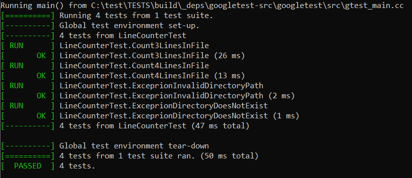

# linecounter
C++ test task

**linecounter** calculates the total number of lines in all files in a given directory. Files found in directory are processed as text files.

Usage example:
```
linecounter <path-to-a-directory>
14124
```
## Prerequisites

To complete program, you'll need:

- A compatible C++ compiler that supports at least C++17.
- [CMake](https://cmake.org/) and a compatible build tool for building the project.
    - Compatible build tools include [Make](https://www.gnu.org/software/make/), [Ninja](https://ninja-build.org/), or others [CMake Generators](https://cmake.org/cmake/help/latest/manual/cmake-generators.7.html).

## How to build

```
mkdir build
cd mkdir
cmake ..
cmake -build .
```

## Build Unit Tests and Run

```
cd TESTS && mkdir build
cd TESTS/mkdir
cmake ..
cmake -build .
ctest
```

